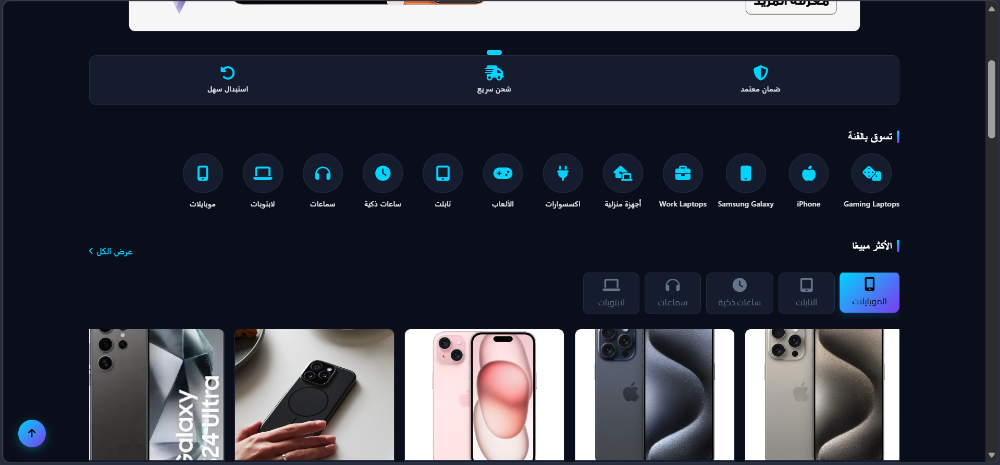
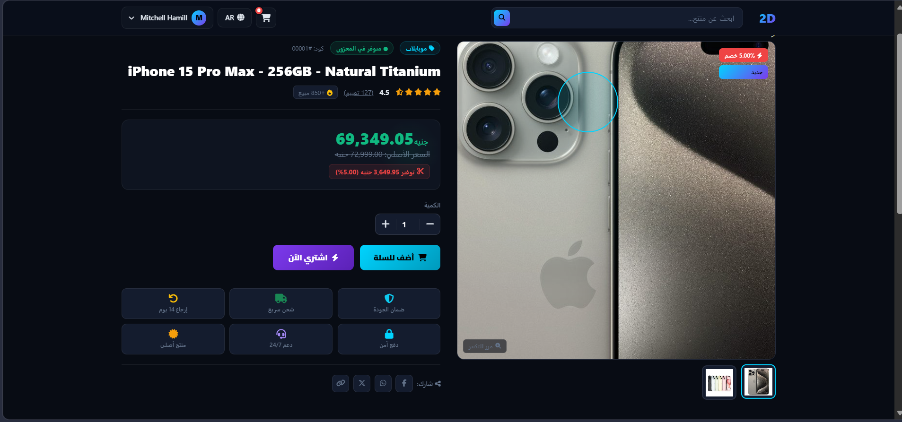
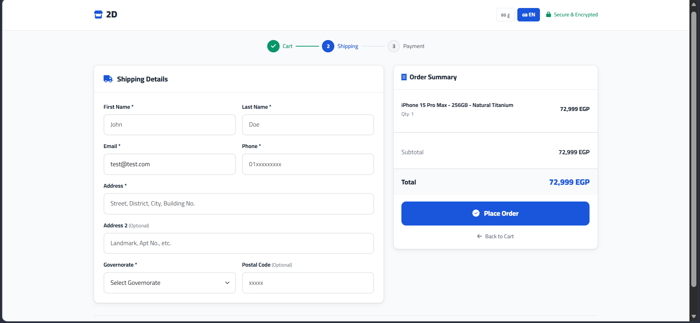
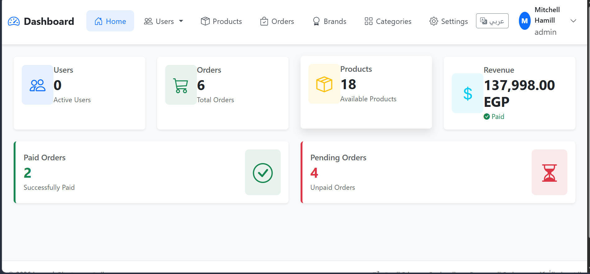

### 🏠 Homepage Preview
```
```


### 🛍️ Product Catalog




### 💳 Payment Integration (Paymob)





### 🔐 Admin Dashboard




---

## ✨ Key Features

| Feature | Description |
|---------|-------------|
| 🌐 **Bilingual** | Arabic / English with RTL/LTR switching |
| 🛍️ **Product Catalog** | Categories, brands, and advanced filtering |
| 🔍 **Smart Search** | Filter by category, brand, and price range |
| 🛒 **Shopping Cart** | Supports both guests and logged-in users |
| 💳 **Online Payments** | Integrated with **Paymob** payment gateway |
| 📦 **Order Tracking** | Full order lifecycle with status updates |
| ❌ **Order Cancellation** | Users can cancel orders before processing |
| 🔐 **Admin Panel** | Complete control dashboard |
| 📱 **Responsive** | Mobile-first design |
| 🌙 **Dark Theme** | Modern dark frontend |

---

## 🧰 Tech Stack

| Layer | Technology |
|-------|------------|
| **Backend** | Laravel 10+ (PHP 8.1+) |
| **Frontend** | Blade, Bootstrap 5, Tailwind CSS |
| **Database** | MySQL |
| **Payment** | Paymob API |
| **Authentication** | Laravel Sanctum |
| **Styling** | Custom CSS + Bootstrap RTL/LTR |

---

## 🚀 Getting Started

### Requirements
- PHP 8.1+
- Composer
- MySQL
- Node.js (optional, for asset compilation)

### Installation Steps

```bash
# 1. Clone the repository
git clone https://github.com/mohamedwah77ed/e-commerce.git
cd dubai-phone

# 2. Install PHP dependencies
composer install

# 3. Setup environment
cp .env.example .env
php artisan key:generate

# 4. Configure database in .env
# DB_DATABASE=your_db
# DB_USERNAME=your_user
# DB_PASSWORD=your_password

# 5. Run migrations and seeders
php artisan migrate --seed

# 6. Start the server
php artisan serve
```

---

## ⚙️ Environment Configuration

Add these variables to your `.env` file:

```env
# Application
APP_NAME="Dubai Phone"
APP_LOCALE=ar

# Paymob Payment Gateway
PAYMOB_API_KEY=your_api_key
PAYMOB_INTEGRATION_ID=your_integration_id
PAYMOB_IFRAME_ID=your_iframe_id
PAYMOB_HMAC=your_hmac_secret
PAYMOB_BASE_URL=https://accept.paymob.com
```

---

## 🗄️ Database Schema

```
┌─────────────────────┐
│      USERS          │
├─────────────────────┤
│ - id (PK)           │
│ - name              │
│ - email             │
│ - role              │
│ - password          │
└──────────┬──────────┘
           │ (1:N)
           ├──────────────────┬──────────────────┬──────────────────┐
           ↓                  ↓                  ↓                  ↓
    ┌─────────────┐   ┌──────────────┐  ┌────────────────┐  ┌───────────────┐
    │   ORDERS    │   │ CART_ITEMS   │  │  WISHLIST      │  │  CATEGORIES   │
    ├─────────────┤   ├──────────────┤  ├────────────────┤  ├───────────────┤
    │ - id (PK)   │   │ - id (PK)    │  │ - id (PK)      │  │ - id (PK)     │
    │ - user_id   │   │ - user_id    │  │ - user_id      │  │ - added_by    │
    │ - order_#   │   │ - product_id │  │ - product_id   │  │ (added_by fk) │
    │ - status    │   │ - order_id   │  │ - created_at   │  │ - parent_id   │
    │ - total     │   │ - quantity   │  └────────────────┘  │ (self-ref)    │
    └────┬────────┘   └──┬───────────┘                       └───────────────┘
         │ (1:N)         │ (M:1)
         └────────┬──────┘
                  ↓
         ┌──────────────┐
         │  PRODUCTS    │
         ├──────────────┤
         │ - id (PK)    │
         │ - cat_id (FK)│
         │ - brand_id   │
         │ - price      │
         │ - discount   │
         │ - stock      │
         └────┬─┬───┬──┘
              │ │   │ (1:N)
         (M:1)│ │   └──────────┬──────────────┐
              │ │              ↓              ↓
              │ └────────┐  ┌─────────────┐  ┌──────────────┐
              │          ↓  │ CATEGORIES  │  │ PRODUCT_IMG  │
              │    ┌──────────────┐       │  ├──────────────┤
              │    │   BRANDS     │       │  │ - id (PK)    │
              │    ├──────────────┤       │  │ - product_id │
              │    │ - id (PK)    │       │  │ - image      │
              │    │ - title      │       │  └──────────────┘
              │    │ - slug       │       │
              └────│ - status     │       │
                   └──────────────┘       │
                                        └─ (M:1 FK)
```

---

## 📁 Project Structure

```
app/
├── Http/Controllers/
│   ├── OrderController.php       # Order creation & management
│   ├── PaymobController.php      # Payment gateway integration
│   ├── LanguageController.php    # Language switching (AR/EN)
│   └── Admin/                    # Admin panel controllers
├── Models/
│   ├── User.php
│   ├── Order.php
│   ├── Product.php
│   ├── Category.php
│   └── Brand.php
├── Services/
│   └── Cart/
│       ├── UserCartService.php   # Cart for authenticated users
│       └── GuestCartService.php  # Session-based guest cart
└── Helpers/
    └── helpers.php               # trans_lang(), trans_dir(), is_rtl()

resources/views/
├── frontend/                     # Customer-facing views
└── backend/                      # Admin dashboard views

database/
├── migrations/
└── seeders/
    ├── UserSeeder.php
    ├── CategorySeeder.php
    ├── BrandSeeder.php
    └── ProductSeeder.php
```

---

## 🌍 Localization

Custom bilingual helper function:

```php
// Usage in Blade templates
{{ trans_lang('نص عربي', 'English Text') }}
```

**Language Switching:**
```
GET /lang/{locale}  →  LanguageController@switchLocale
```

Supported locales configured in `config/locales.php`.

---

## 💳 Payment Flow (Paymob)

| Step | Action |
|------|--------|
| 1 | Customer fills checkout form |
| 2 | Order is created in database |
| 3 | Customer redirected to Paymob payment page |
| 4 | Paymob sends callback to `/paymob/callback` |
| 5 | Order status updated to `paid` + `processing` |

---

## 👤 Default Admin Account

After running seeders:

| Field | Value |
|-------|-------|
| Email | `admin@example.com` |
| Password | `password` |
| Role | `admin` |

> ⚠️ **Important:** Change the password immediately after first login!

---

## 📝 License

This project is open-sourced under the [MIT License](LICENSE).

---


